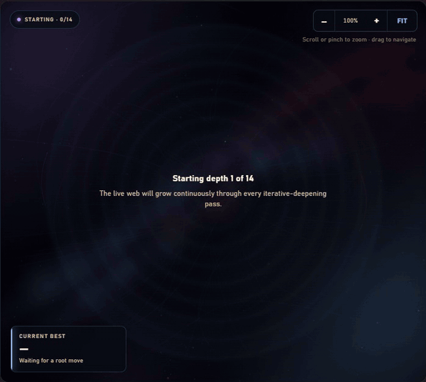
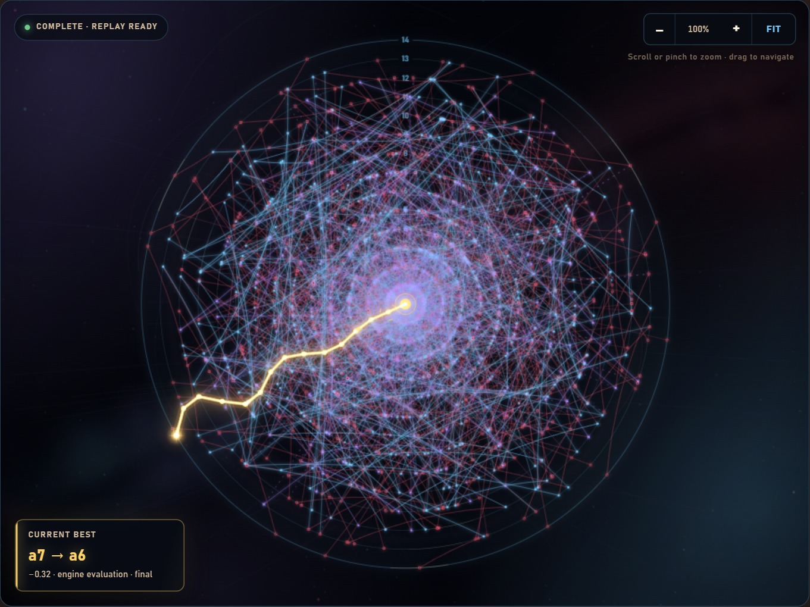
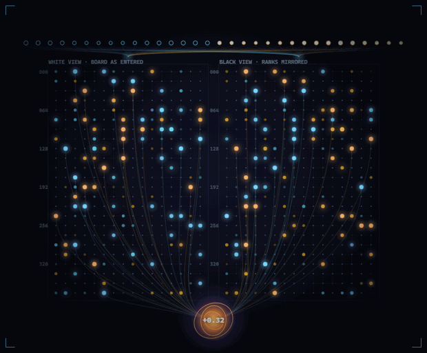

# Sgurr

[](https://github.com/TomGreenwoodPhysics/sgurr-chess-engine/actions/workflows/ci.yml)

**[Play online](https://sgurr-chess-engine.onrender.com/)** ·
**[Search Lab](https://sgurr-chess-engine.onrender.com/search-lab/)** ·
**[Evaluation Lab](https://sgurr-chess-engine.onrender.com/inside-sgurr/evaluation.html)**

Sgurr is a C++20 UCI chess engine with an NNUE trained on its own self-play
games. The current release is **v8.2 "Thearlaich"**, measured at an estimated
**3012** on a CCRL-Blitz-anchored scale.

The hosted site runs the real Sgurr executable. It is on Render's free tier,
so the first visit after a quiet period can take 30 to 60 seconds to start.

<p align="center">
  <a href="https://sgurr-chess-engine.onrender.com/search-lab/">
    
  </a>
</p>

That is a real depth-14 search trace played back at the speed it happened.
The engine searches for about two seconds, then the graph is left to settle.

Sgurr started as a way for me to learn what sits inside a chess engine. It now
includes the engine, its training pipeline, match and rating tools, and a web
application that exposes the parts normally hidden behind `bestmove`.

## Try it

### Play Sgurr

[The main site](https://sgurr-chess-engine.onrender.com/) lets you play the
current engine, build a position, analyse it and review a finished game. The
local version can also load every release from the classical evaluation to
v8.2.

### Search Lab

[The Search Lab](https://sgurr-chess-engine.onrender.com/search-lab/) draws the
tree while Sgurr searches. The centre is the root position and each ring is one
ply deeper. Red marks a cutoff, violet marks a transposition-table hit, and the
gold path is the principal variation from the last completed iteration.



This is a depth-14 search of the Kiwipete test position. Sgurr chose 1.Bxa6 at
−0.51 after searching 1,332,421 nodes in 745 ms. The settled graph draws 1,494
of them.

Drawing every node would be slow and unreadable. The trace keeps a bounded
sample at each depth and favours nodes that raised alpha, caused a cutoff or
reached the principal variation. The Search Lab also includes a guided tour
for readers who have not met alpha-beta search before.

### Evaluation Lab

[The Evaluation Lab](https://sgurr-chess-engine.onrender.com/inside-sgurr/evaluation.html)
loads the shipped Gen8 network in a browser worker and verifies its SHA-256.
It then reproduces the engine's quantised integer forward pass exactly.

<p align="center">
  <a href="https://sgurr-chess-engine.onrender.com/inside-sgurr/evaluation.html">
    
  </a>
</p>

The board drives both 384-lane accumulators. A move can be inspected before,
during and after its incremental update. Individual pieces can be followed
from their feature rows through the clipped activation and into the final
score. There is a short first-run tutorial for people without a machine
learning background.

## How Sgurr works

### Search

The engine uses bitboards and magic-bitboard sliders. A structure built at each
node carries the king square, checker count, pin mask and check mask. That lets
move legality be answered directly without making and unmaking every candidate.

Search is iterative deepening over negamax, alpha-beta and principal variation
search. It includes aspiration windows, a transposition table, null-move
pruning, late move reductions, reverse futility pruning, late move pruning,
razoring, singular and check extensions, quiescence search, static exchange
evaluation, killers, butterfly history, continuation history and best-move
stability time management.

The singular-extension search is isolated from the normal tree. It cannot use
a transposition-table cutoff, null move or transposition-table store while a
move is excluded.

Every search feature added since v4.0 has a compile-time switch. One feature
can be removed and tested without maintaining a separate source branch.

### Evaluation

The shipped network has a `768 → 384 → 1` perspective architecture. Its
accumulators update incrementally through make and unmake, and inference stays
integer-quantised from the network file to the returned score.

The engine selects AVX-512, AVX2 or scalar inference at runtime. All three
paths produce bit-identical output. Every accumulator update checks the
position's Zobrist key first and rebuilds from the board if the state does not
match. A missed update can lose time, but it cannot quietly corrupt the score.

A hand-written evaluation remains as a fallback when no network loads. It uses
tapered material and piece-square tables, pawn structure, king safety, mobility
and a bare-king mop-up term. It is roughly 630 Elo weaker than the NNUE, but it
is still useful as a readable reference.

### Training

The training loop is built in this repository. Sgurr generates self-play
positions, labels them with the previous network generation, trains a new
network, exports the quantised file and tests it in games. External engines are
used as rating anchors only. They never provide training positions or labels.

One resumable command runs a generation.

```bash
python pipeline.py configs/pipeline_gen8.json
python pipeline.py configs/pipeline_gen8.json --status
```

The stages cover parallel datagen, dataset freezing, training, building,
candidate selection, SPRT, pool calibration and the results ledger. Each stage
checkpoints, and datasets, weights and ledger rows are append-only.

The data generator writes fixed 32-byte records into separate worker shards.
A stopped process can leave a partial tail, which the loader ignores by
rounding down to the last complete record.

### Web application

FastAPI serves the frontend and owns a persistent UCI process. It validates
positions and moves with `python-chess`, sends search commands to Sgurr, parses
the UCI information stream and returns the updated state to the browser.

The frontend uses native ES modules and CSS with no build step. Search traces
run through a separate diagnostic engine process, so opening the Search Lab
does not interrupt a game. Production media is served through a filename
allowlist rather than mounting the repository asset directory.

[web/README.md](web/README.md) documents the API, production settings and the
split-frontend development setup.

## Strength

Sgurr v8.2 was measured under controlled conditions matching CCRL's published
requirements for hash, book, pondering and thread count.

| engine | rating | pool | games |
|---|---|---|---|
| **Sgurr v8.2 "Thearlaich"** | **3012 ±6** sampling, **about ±25** systematic | pool-2026-08-D | 9,890 |

This is an internal estimate, not an official CCRL rating. Sgurr has not been
submitted to CCRL and does not appear on its published lists. The value comes
from an Ordo solve against five open-source engine families with published
CCRL Blitz ratings.

The small error bar measures sampling noise. The larger one reflects the fact
that the anchors do not transfer perfectly to another machine and time control.
Solved separately, they place Sgurr at 3004, 3036, 3001, 2986 and 3034. More
games would narrow the first uncertainty, but not the 50 Elo spread between
those answers.

The current figure replaced an earlier estimate of 3058. The engine did not
change. The measurement did. The old setup left hash sizes uncontrolled, used
an opening book filtered by Sgurr's own evaluation and included two opponents
that forfeited many games on illegal promotion moves. The full correction is
recorded in [Methodology section 9](docs/METHODOLOGY.md#9-measuring-the-measurement-v82-at-3012-not-3058).

Version-to-version gaps are more reliable than the absolute number because
they are solved inside the same pool. The direct SPRTs agree with those gaps.
For example, v4.0 gained 54 Elo in the pool and 55.5 ±17.0 in its direct match.

<details>
<summary><strong>Earlier release ladder</strong></summary>

These versions were measured on the earlier pool before all conditions were
controlled. Their ordering and internal gaps remain useful, but their absolute
ratings sit roughly 45 Elo too high. Re-measuring every old release is still
owed.

| engine | earlier pool rating |
|---|---|
| Sgurr v8.2 "Thearlaich" | 3058 ±7 |
| Sgurr v8.1 "Thearlaich" | 3027 ±11 |
| Sgurr v8.0 "Thearlaich" | 3006 ±11 |
| Sgurr v7.0 "Ghreadaidh" | 2903 ±6 |
| Sgurr v6.0 "Banachdaich" | 2807 ±36 |
| Sgurr v5.0 "Gillean" | 2724 ±36 |
| Sgurr v4.0 "MacKenzie" | 2604 ±27 |
| Sgurr v3.0 "Blackpeak" | 2590 ±39 |
| Sgurr v3.1 "Blackpeak" | 2541 ±27 |
| Sgurr v2.0 "Notches" | 2467 ±34 |
| Sgurr v1.0 "Fox" | 2386 ±34 |
| Sgurr classical | 2377 ±35 |

</details>

## What the measurements changed

Some of the most useful results were the ones that proved an assumption wrong.

Training loss does not select strong networks on this data. Five networks
trained on the same positions ranked almost backwards when loss was compared
with games. The best loss gained 2 Elo and the worst gained 9. Candidates are
therefore selected by games rather than loss.

Training is not reproducible at the Elo level either. Two runs with the same
data and recipe but different random seeds scored +13.7 ±10.3 over 3,000 games.
Small network gains can be seed luck, so changes below roughly 25 Elo need
several seeds or much stronger evidence.

Speed work is checked with a deterministic fixed-depth benchmark. If two builds
search the same nodes in the same order, their output fingerprints match. That
is how the AVX inference, PGO build and data-layout changes were shown to alter
speed without changing search behaviour.

Negative results stay in the repository. v3.1 rates below v3.0. Eight king
buckets reduced training loss but measured −10.7 ±16 Elo, so the plain network
shipped. A ten-item v9.0 search batch measured −1.0 ±21.1 and was held back.

[docs/METHODOLOGY.md](docs/METHODOLOGY.md) has the complete account, including
the findings that were later withdrawn.

## Repository layout

```text
sgurr_cpp/     C++ engine, search, NNUE inference and datagen
nnue/          PyTorch trainer, quantisation, export and verification
nets/          shipped network, release record and SHA-256
pipeline.py    resumable command for a full network generation
configs/       generation-specific pipeline settings
testing/       matches, SPRT, SPSA and opening-book tools
benchmarks/    rating pools, anchors, predictions and results ledger
data/          dataset manifests, checksums and training logs
web/           FastAPI backend and browser frontend
sgurr_python/  earlier Python engine kept as a readable reference
tools/         calibration and datagen launchers
docs/          methodology, engineering log, roadmap and notices
```

## Build and run

The supported Windows build uses the MSYS2 `clang64` shell.

```bash
cd sgurr_cpp
./build.sh                     # development build
./build.sh -r                  # PGO and ThinLTO release build
./build.sh -d                  # data generator
./build.sh -t                  # search trace build
```

The release build is 11.3% faster than plain `-O3 -march=native` over 12
interleaved runs and keeps the same search fingerprint. `build.sh` also checks
that the new executable can start. This catches Windows Smart App Control
blocking a freshly linked unsigned binary before it silently forfeits a match.

Run the engine over UCI.

```bash
SGR_EVALFILE=../nets/gen8.nnue ./sgr.exe
```

```text
uci
setoption name Hash value 256
position startpos moves e2e4 e7e5
go movetime 1000
```

Without `SGR_EVALFILE`, Sgurr loads the hand-written evaluation and reports the
fallback on standard output.

The engine exposes 48 UCI options. Four cover hash, hash clearing, move overhead
and threads. The other 44 expose search margins, divisors and thresholds for
tuning. Search is intentionally single-threaded because the rating work uses a
single-core scale.

To run the web application locally, build the release and trace executables,
then install the backend requirements and start Uvicorn.

```bash
python -m pip install -r web/backend/requirements.txt
python -m uvicorn web.backend.main:app --host 127.0.0.1 --port 8000
```

Open <http://127.0.0.1:8000/>. Platform-specific paths and environment
variables are covered in [web/README.md](web/README.md).

## Tests and reproducibility

From `sgurr_cpp/`, the main engine checks are straightforward.

```bash
SGR_EVALFILE=../nets/gen8.nnue ./sgr.exe bench
./sgr.exe bench
./sgr.exe test
./sgr.exe seetest
```

The expected MSYS2 clang fingerprints are 3,601,424 nodes with Gen8 and
4,616,415 with the hand-written evaluation. Move generation reaches perft 4 at
197,281 nodes, and the static exchange suite contains nine hand-checked cases.

The fingerprint is toolchain-local. `std::sort` may order equal-scoring moves
differently between standard libraries, which changes the tree without
changing legal behaviour. CI checks determinism and scalar/vector agreement on
each platform rather than comparing Linux against a Windows node total.

The NNUE self-check compares engine inference with the trainer's forward pass
across special moves and random game chains. The shipped network currently
passes 4,516 checks with no failures. Its release hash is recorded in
[nets/README.md](nets/README.md).

Run the backend and browser suites from the repository root.

```bash
python -m unittest discover -s web/backend -p "test_*.py"

cd web
npm ci
npx playwright install chromium
npx playwright test
```

Strength changes use SPRT at 8+0.08 against the previous accepted version.
Release calibration uses the fixed pool at 10+0.1. Every result is reported
with an interval. [testing/README.md](testing/README.md) explains the match
runner, opening book and decision bounds.

## Tech stack

| part | tools |
|---|---|
| engine | C++20, clang, PGO and ThinLTO |
| inference | hand-written AVX-512 and AVX2 with a scalar fallback |
| training | Python 3.12, PyTorch and NumPy |
| rating | fastchess, Ordo and an in-repo SPRT harness |
| web backend | FastAPI, Uvicorn and python-chess |
| web frontend | native ES modules and CSS |
| browser tests | Playwright |

## Recent releases

Versions are named after Sgùrr peaks in ascending height. Version numbers are
canonical and the peak names are codenames.

| version | change | measured result |
|---|---|---|
| v8.0 "Thearlaich" | Gen8 NNUE trained on 55.9 million clean positions | +126.5 ±26.6 against v7.0 |
| v8.1 "Thearlaich" | PGO, ThinLTO and nine node-identical optimisations | about 20% faster and +21.2 ±8.7 against v8.0 |
| v8.2 "Thearlaich" | packed transposition entries and a lazy move picker | 15.4% faster and +31.5 against v8.1 in the pool |

The complete history, including the releases that lost strength, is in
[docs/CHANGELOG.md](docs/CHANGELOG.md).

## Further reading

- [docs/METHODOLOGY.md](docs/METHODOLOGY.md) contains the main findings and the
  conclusions that had to be withdrawn.
- [benchmarks/ledger.md](benchmarks/ledger.md) is the append-only results record
  with game counts and caveats.
- [docs/DEVLOG.md](docs/DEVLOG.md) is the dated engineering log.
- [docs/ROADMAP.md](docs/ROADMAP.md) records what is next and why.
- [sgurr_cpp/BUILD.md](sgurr_cpp/BUILD.md) covers the compiler, PGO recipe and
  fingerprint checks.
- [web/README.md](web/README.md) covers local and hosted web deployments.

## Earlier Python engine

The first Sgurr implementation has its own board representation, move
generation, FEN parser, hashing, evaluation and search. It can run as a UCI
engine or as a small terminal program.

```bash
python -m sgurr_python.sgurr_engine uci
python -m sgurr_python.sgurr_engine
```

It scored about 49.6% over 1,000 games against Stockfish limited to 1500 Elo at
0.50 seconds per move. I have kept it because it is much easier to read than
the current engine, not because it is a strength target.

## The name

Sgùrr is Gaelic for a rocky mountain peak. The engine name uses the plain ASCII
`Sgurr`, and the binary is `sgr`. It was called Ruk before that (I did not know
RukChess was already the name of a strong engine), and Bitfish before that.

## Licence

Original Sgurr material is proprietary under [LICENSE](LICENSE). You may read,
build, run and evaluate it. Third-party software and assets keep their own
terms, recorded in [docs/THIRD_PARTY_NOTICES.md](docs/THIRD_PARTY_NOTICES.md)
and [docs/THIRD_PARTY_ASSETS.md](docs/THIRD_PARTY_ASSETS.md).
